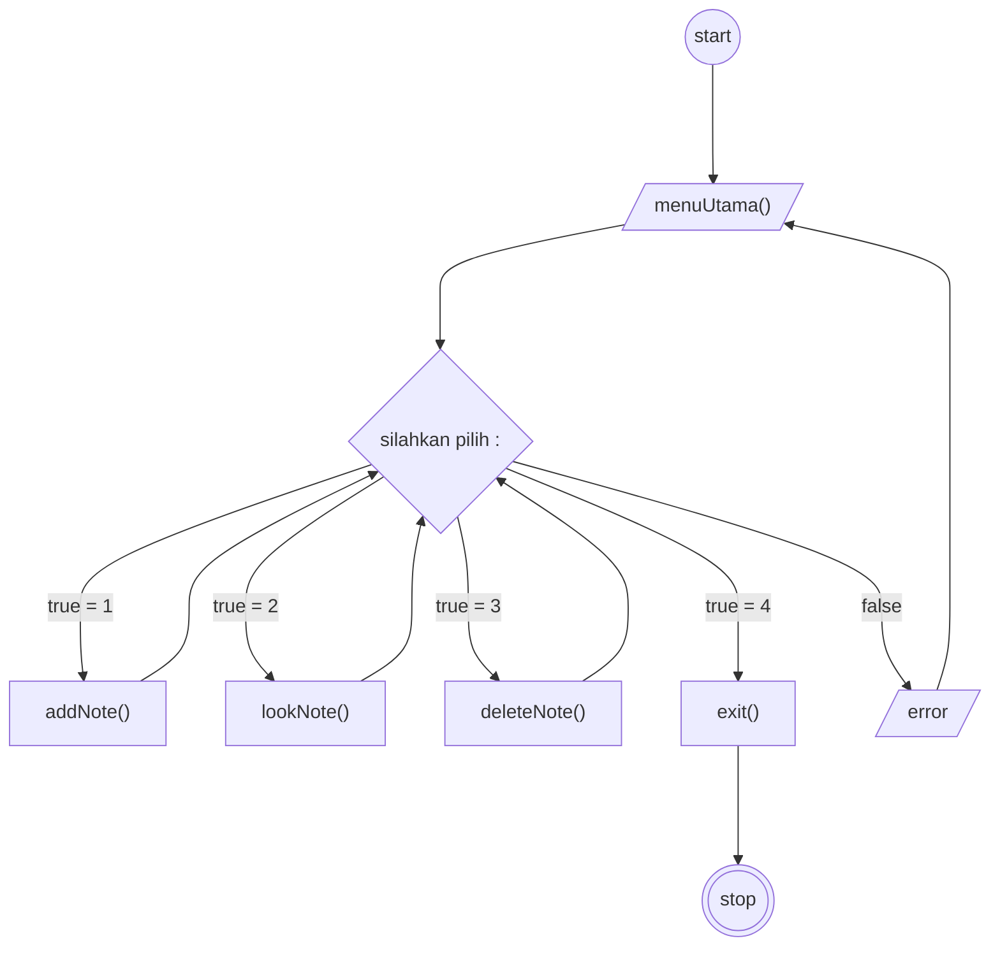

# Flowchart Note App

```mermaid
flowchart TB


start((start))
stop(((stop)))

menuUtama@{shape: lean-r, label: "menuUtama()"}
tanya@{shape: decision, label: "silahkan pilih :"}
addNote@{shape: rect, label: "addNote()"}
lookNote@{shape:rect, label: "lookNote()"}
deleteNote@{shape:rect, label: "deleteNote()"}
exit@{shape: rect, label: "exit()"}
false@{shape: lean-r, label: error}


start--->menuUtama--->tanya
tanya--true = 1--->addNote
addNote-->tanya
tanya--true = 2--->lookNote
lookNote--->tanya
tanya--true = 3--->deleteNote
deleteNote--->tanya
tanya--true = 4--->exit--->stop
tanya--false--->false--->menuUtama

```
