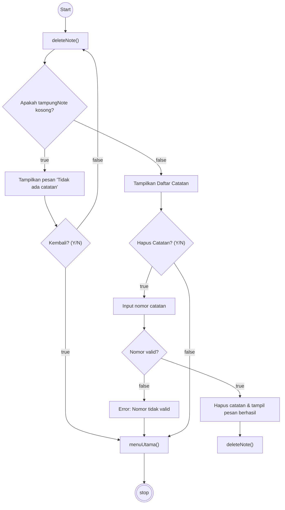

```mermaid
flowchart TB

Start((Start))
DeleteNote["deleteNote()"]
CheckEmpty{"Apakah tampungNote kosong?"}
NoNote["Tampilkan pesan 'Tidak ada catatan'"]
AskBack{"Kembali? (Y/N)"}
MenuUtama["menuUtama()"]
stop(((stop)))
ShowNotes["Tampilkan Daftar Catatan"]
AskDelete{"Hapus Catatan? (Y/N)"}
AskNumber["Input nomor catatan"]
ValidNumber{"Nomor valid?"}
DeleteSuccess["Hapus catatan & tampil pesan berhasil"]
Error["Error: Nomor tidak valid"]
LoopBack["deleteNote()"]

Start --> DeleteNote --> CheckEmpty
CheckEmpty -- "true" --> NoNote --> AskBack
AskBack -- "true" --> MenuUtama ---> stop
AskBack -- "false" --> DeleteNote

CheckEmpty -- "false" --> ShowNotes --> AskDelete
AskDelete -- "true" --> AskNumber --> ValidNumber
ValidNumber -- "true" --> DeleteSuccess --> LoopBack
ValidNumber -- "false" --> Error --> MenuUtama
AskDelete -- "false" --> MenuUtama

```
