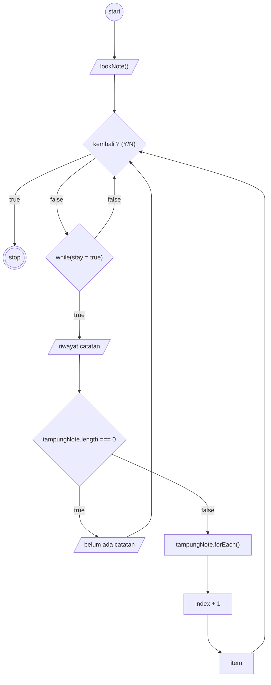

```mermaid
flowchart TB


start((start))
stop(((stop)))

back@{shape: decision, label: kembali ? (Y/N)}

lookNote@{shape: lean-r, label: "lookNote()"}
stay@{shape: decision, label: while(stay = true)}
console@{shape: lean-r, label: riwayat catatan}
tampungNote@{shape: decision, label: tampungNote.length === 0}
belum@{shape: lean-r, label: belum ada catatan}
false@{shape: rect, label: tampungNote.forEach()}
log@{shape: rect, label: index + 1}
item@{shape: rect, label: item}


start--->lookNote--->back--false-->stay
stay--true--->console--->tampungNote
stay--false--->back
tampungNote--false--->false
tampungNote--true--->belum
false--->log--->item
item--->back--true--->stop
belum--->back
```
