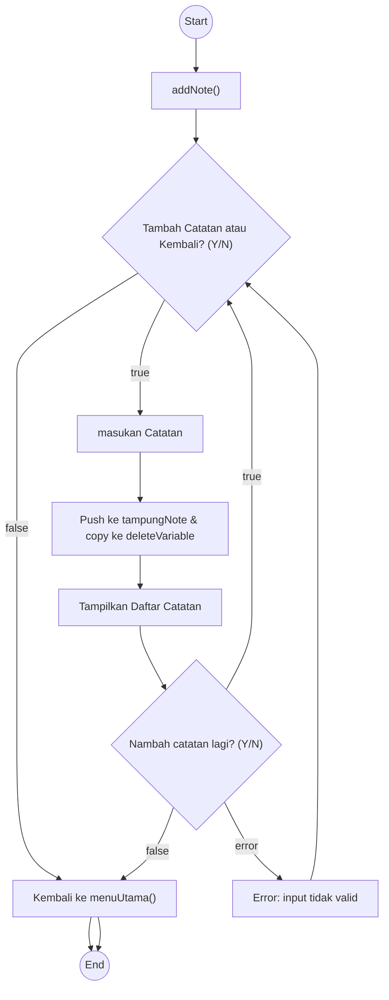

```mermaid
flowchart TB

Start((Start))
AddNote["addNote()"]
AskCatatan{"Tambah Catatan atau Kembali? (Y/N)"}
InputCatatan["masukan Catatan"]
PushArray["Push ke tampungNote & copy ke deleteVariable"]
Display["Tampilkan Daftar Catatan"]
MenuUtama["Kembali ke menuUtama()"]
AskAgain{"Nambah catatan lagi? (Y/N)"}
Error["Error: input tidak valid"]
End((End))

Start --> AddNote --> AskCatatan
AskCatatan -- "true" ---> InputCatatan --> PushArray --> Display --> AskAgain
AskCatatan -- "false" --> MenuUtama --> End

AskAgain -- "true" --> AskCatatan
AskAgain -- "false" --> MenuUtama --> End
AskAgain -- error --> Error --> AskCatatan

```
